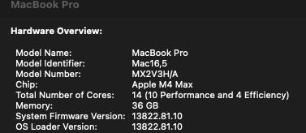

# Reproduction steps for Illegal instruction (core dumped) on dotnet build in podman

1. Add some dependencies to increase the odds of failure. Uncomment some of the ones already in .csproj
2. Try build image `podman build --no-cache .`

## My setup
#### Mac M4
````bash
arch
# arm64
````


#### Podman

```bash
podman -v                
#podman version 5.8.0
```

#### Podman Desktop

###### Podman machine settings:
- CPU(s): 7
- Disk size: 100gb
- Memory: 4GB
- Machine with root privileges: disabled
- Provider Type: Apple HyperVisor

###### Extension: Podman
Rosetta: Enabled

## How did i set this repo up?
1. Init new project `dotnet new console`
2. Add Dockerfile that copies everything and runs dotnet build
3. Try build image `podman build --no-cache .`

## Notes
- The number of dependencies impact the probability of encountering the Illegal instruction error. (timing?)
  - I have seen the error with 0 dependencies, but its rare. Did about 30 builds before i saw one.
  - With just redis it fails about 50% of builds
  - With a normal amount of dependencies its almost guaranteed to fail
- Changing the Podman Machine provider-type to LibKRun is the only way i have found to eliminate the issue. 
  - A side effect is that i cant start the mssql image in podman, unless i use AppleHypervisor with Rosetta.
    - I need to switch Podman Machine depending on which one i want to run, and i cant run mssql and dotnet build on the same machine.
    - Image: https://hub.docker.com/r/microsoft/mssql-server
